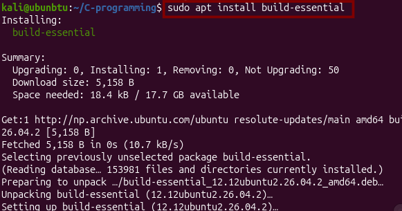
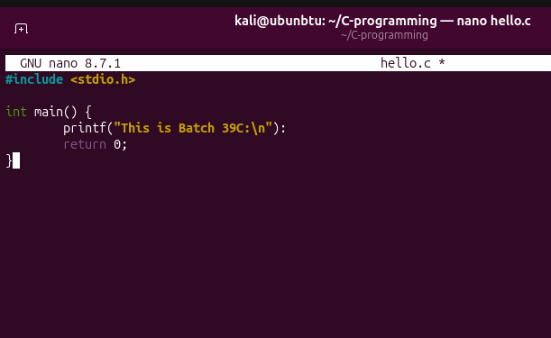
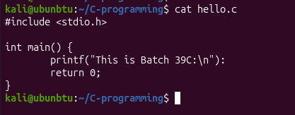
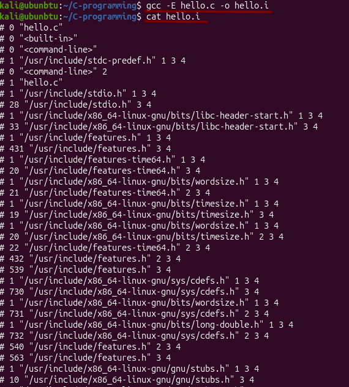
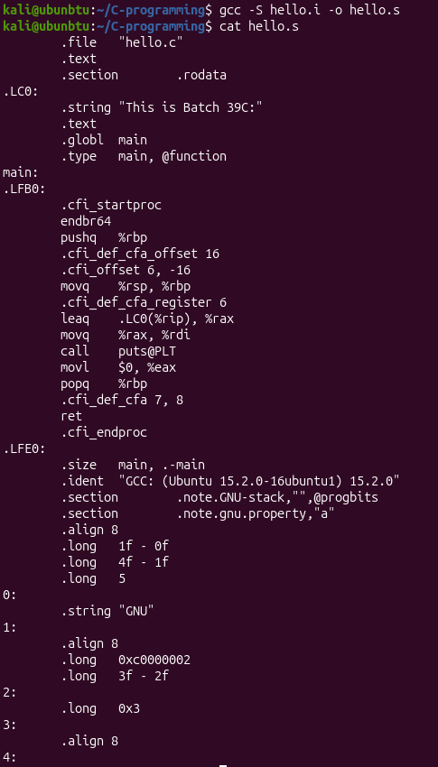
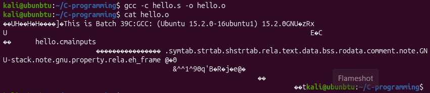
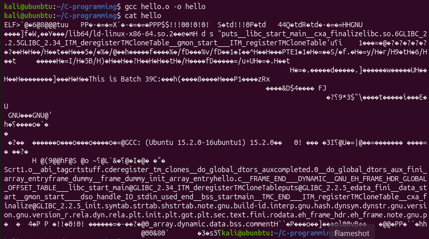

# Lab 1: Compilation

## Overview
This lab explores the C compilation process — from source code to an executable.

## Files

| File | Description |
|------|-------------|
| `hello.c` | Source code: prints `This is Batch 39C:` |
| `hello.i` | Preprocessed output (`gcc -E hello.c -o hello.i`) |
| `hello.s` | Generated assembly code (`gcc -S hello.c -o hello.s`) |
| `hello.o` | Object file, not yet linked (`gcc -c hello.c -o hello.o`) |
| `hello` | Final linked executable (`gcc hello.c -o hello`) |

## How to Compile

```bash
gcc -E hello.c -o hello.i   # Preprocess
gcc -S hello.c -o hello.s   # Compile to assembly
gcc -c hello.c -o hello.o   # Assemble to object file
gcc hello.c   -o hello      # Link to executable
./hello
```

## Documentation & Screenshots








