# Lab 2: Process Lifecycle

## Overview
This lab covers how Linux processes are created, identified, controlled, and terminated from C.

## Files

| File | Description |
|------|-------------|
| `task1_alive.c` | Prints a start message, sleeps 30 seconds, then prints a finish message. |
| `task2_identity.c` | Prints the process ID (`getpid`) and parent process ID (`getppid`), then sleeps 20 seconds. |
| `task3_exit.c` | Reads a number; returns exit status 0 (success) for positive, 1 (failure) for negative. |
| `task4_input.c` | Reads the user's name and prints a welcome message. |
| `task5_countrol.c` | Prints the current PID and asks the user whether to continue or exit. |

## How to Compile & Run

```bash
gcc task1_alive.c -o task1_alive && ./task1_alive
gcc task2_identity.c -o task2_identity && ./task2_identity
gcc task3_exit.c -o task3_exit && ./task3_exit
gcc task4_input.c -o task4_input && ./task4_input
gcc task5_countrol.c -o task5_countrol && ./task5_countrol
```

Check the exit status of a program with:

```bash
echo $?
```

## Documentation & Screenshots

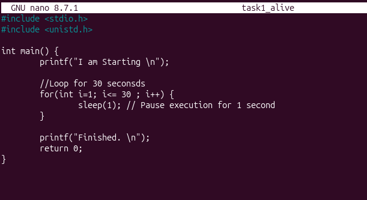
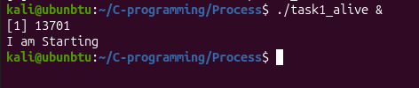
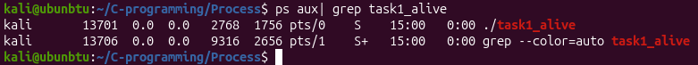
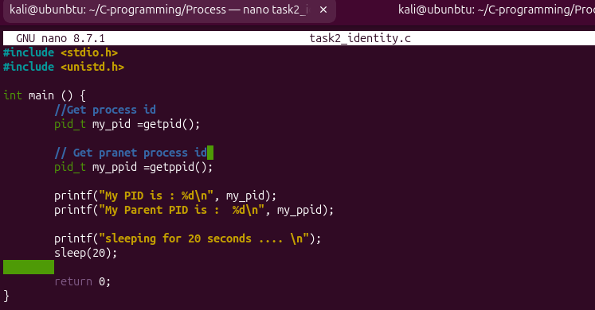

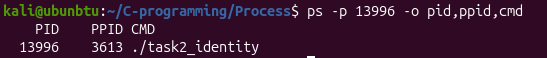
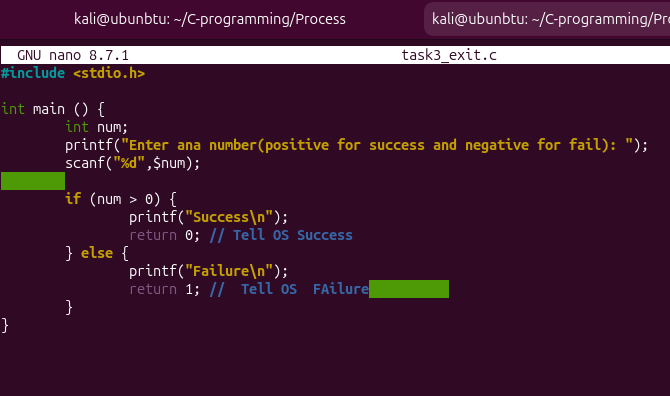
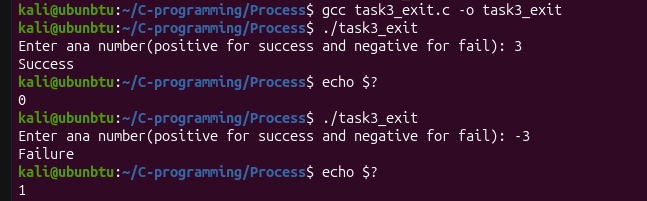
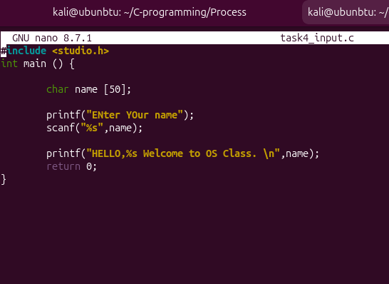
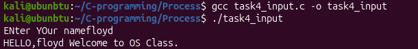
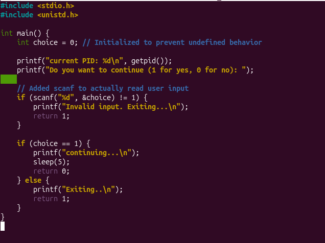
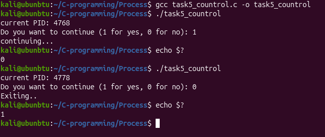
