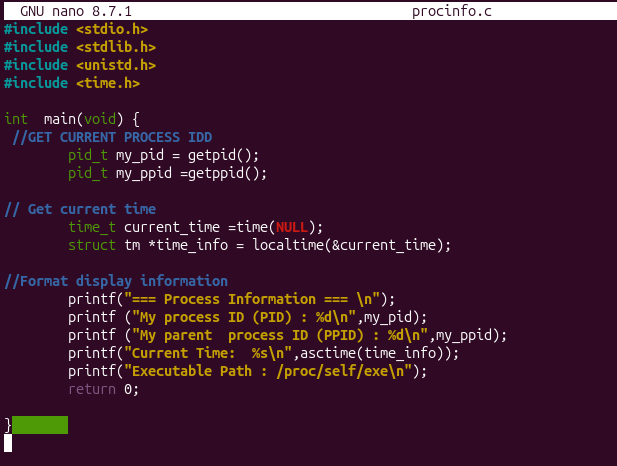
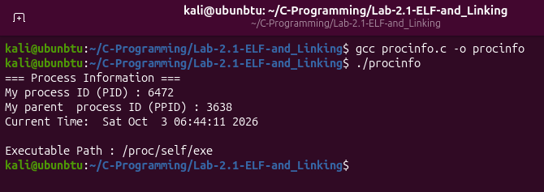
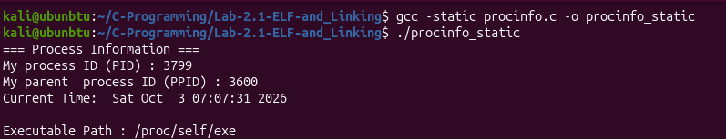
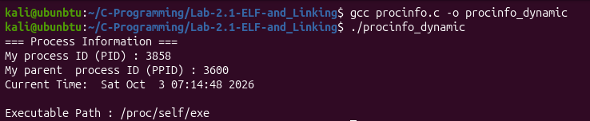
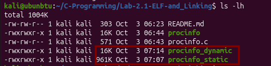
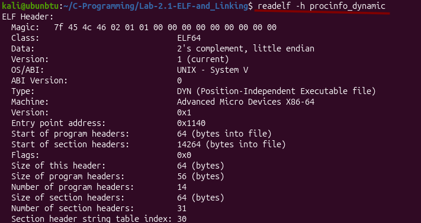
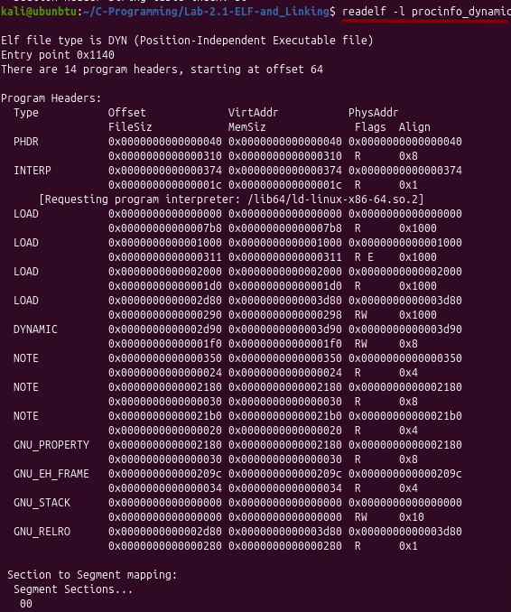
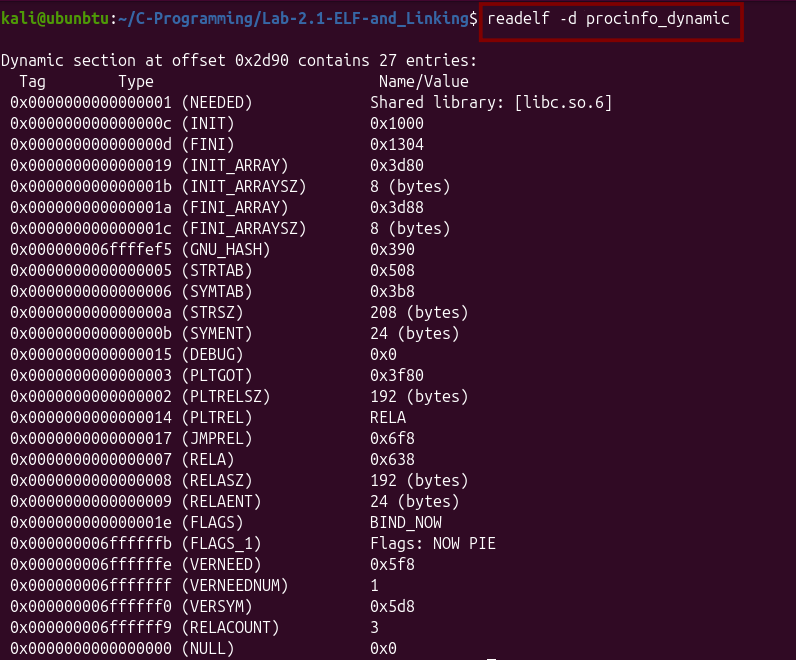
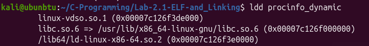

# Lab 2.1 : C libraries,Linking and ELF Executable Structure

## 1. Overview
This lab explores how a C program interacts with the C Standard Library ('libc'),how source code is linked (statically vs dynamically) and how the OS parses the resulting bianary ising the Executable and Linkable Formal (ELF)

## Documentation & Screenshots

